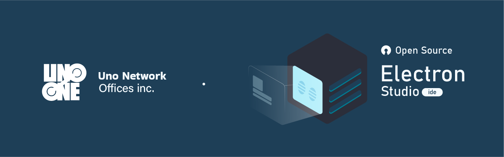

# Electron Studio *(in development)*

**Electron Studio** is a cross-platform Gui Application development ide for Electron Framework.

#

# Weekly updates

- ??

# Obsolete features

- ??

## Features

- Allows editing files   by multiple tabs
- Read and to edit glsl files

## New features

- ??

## Technologies

> Electron Framework 

> Node JS

## Dependencies and installation guide

1. navigate to the desktop *(optional)*

- `$ cd desktop`

2. use git clone to clone the  repository on your local machine

- `$ https://github.com/Uno-Network-Offices-Inc/ElectronStudio-ide.git`

3. navigate to the Project folder

- `$ cd Electron Studio`

4. Install Node JS In the official Web site

- Official Web site [Download](https://nodejs.org/en/download/).

5. Install all dependencies - **NPM**

- `$ npm install`

6. Run the Project with **CMD**

- *(in the project folder)*

- `$ npm start`

## Modifying css sass Preprocessor files

1. install sass globally

- `$ npm install -g sass`

2. Use sass watch to Update   css stylesheet

-  `$ sass watch- design/global.design.scss:./screen.app/editor.screen/editor.design.css`

3. Stopping the Sass compiler

- CTRL + C (in the cmd)

# 

#### © 2022 Uno Network Offices Inc.
